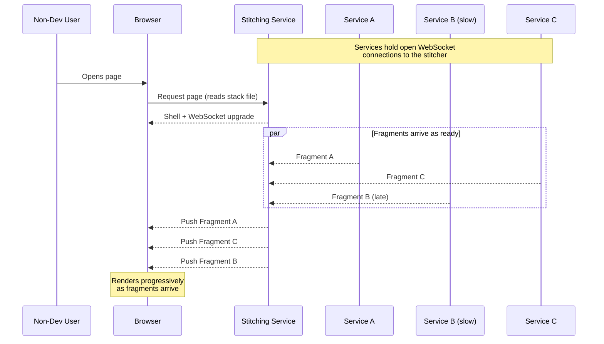
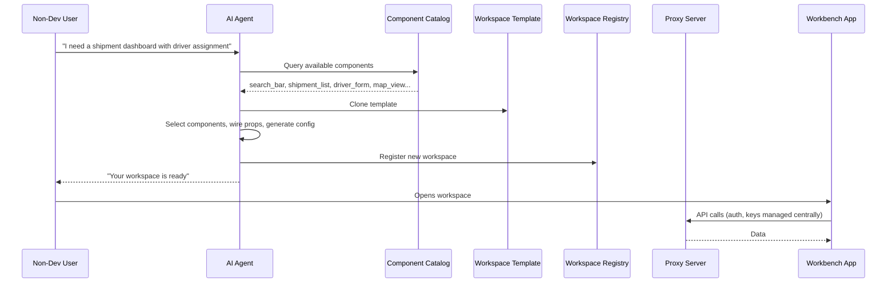

Around 2019, we had a clear problem: domain experts and non-technical staff needed to build and adjust internal tools themselves, without waiting for developer time. We gave them a way to do it with six lines of YAML.

```yaml
shipment_search_page:
  - search_bar
  - shipment_list
  - driver_assignment_form
```

List the blocks. Save the file. A server assembled them into a working page. No code required. No deploy. No pull request. Hundreds of pages were composed this way across the organisation by product managers, operations leads, and domain experts.

If you were building micro frontends around 2019, this will feel familiar. If you were not, it might look primitive. Both reactions are useful for what comes next.

## A moment of déjà vu

A few days ago, our team started discussing how to let non-technical people compose their own internal tools without bothering us every time they need a change. We needed to find a way to make this possible. The conversation quickly rolled into AI agents, chat interfaces, component catalogs. We had heard this exact request before.

Around 2019, at a different company, we faced the same problem. Non-technical people needed to build and adjust their own tools, and we had to make it possible. We solved it with YAML files and a stitching service that composed pages on the fly. No AI involved. The shape of the problem is identical: let non-developers compose applications from pre-built parts without writing code. The machinery is different.

This post is about what changed, what did not, and what we should watch out for.

## Before the agent

The system we built was a server-side composition layer for micro frontends. The blocks in the YAML file --- `search_bar`, `shipment_list`, `driver_assignment_form` --- were UI components. Microservices delivered them. Each microservice had its own repository, its own deploy pipeline, and its own team. Sometimes a single microservice owned one component, sometimes it owned several --- depending on the domain and the use case. Every service held an open WebSocket connection to the stitching layer and pushed HTML fragments over it.

Concurrency was the first-order problem. The composition layer had to hold many open connections, receive fragments from multiple microservices in parallel, handle partial failures, and stream results as they arrived. We picked a runtime where this was the default, not a plumbing exercise.

The delivery model was asynchronous end to end. Services pushed fragments to the stitcher over WebSocket, and the stitcher pushed them to the browser the same way. A slow service did not block a fast one. Users saw the page fill in progressively --- the search bar appeared first, then the driver assignment form, and finally the shipment list when its backing service caught up. We did this because we did not want users staring at a blank page while the slowest service decided to respond.

The cross-component communication model drew from Google's Web Intents proposal: components exchanged data without tight coupling, using a publish-subscribe pattern managed by the composition layer. The overall architecture followed the server-side composition variant described in Martin Fowler's work on micro frontends.



Three properties made this system reliable at scale.

**Deterministic.** Same YAML, same page, every time. No interpretation, no inference. The stack file was the contract.

**Visible composition.** Users saw exactly which blocks they depended on. They could add, remove, or reorder blocks by editing the file. Nothing was hidden.

**Bounded failure.** A crashed microservice got a placeholder. The rest of the page still rendered. A broken shipment list never took down the search bar.

## In the AI era

We are designing a system --- not shipping one --- where non-technical users describe what they need in a chat interface. In practice that interface is a standard agent tool (Claude Code, or something like it) working against the repo; we are not building a bespoke chat app. An AI agent interprets the intent, selects from a developer-maintained catalog of components and templates, and assembles a working workspace. Let's call it Workbench.

React, TypeScript, and Vite on the frontend. A Cloud Run proxy behind it. Auth0 at the boundary. The frontend is organised like this:

```
src/
├── shared/                    # Shared across ALL workspaces
│   ├── components/            # Reusable UI components
│   ├── hooks/                 # Custom React hooks
│   ├── utils/                 # Utility functions (cn, formatters, etc.)
│   ├── constants/             # Shared constants (colors, config)
│   ├── types/                 # Shared TypeScript types
│   └── index.ts               # Barrel export
│
├── workspaces/                # Individual workspaces
│   ├── _template/             # Template for new workspaces
│   │   ├── config.ts          # Workspace configuration
│   │   ├── TemplateWorkspace.tsx  # Main component with routing
│   │   ├── views/             # View components
│   │   └── index.ts           # Exports
│   │
│   ├── shipment-dashboard/    # An example workspace
│   │   ├── config.ts          # Workspace config (id, name, nav items)
│   │   ├── ShipmentDashboard.tsx  # Routes to views
│   │   ├── views/             # ShipmentList, DriverAssignment, etc.
│   │   ├── services/          # API functions specific to this workspace
│   │   └── assets/            # Workspace-specific assets
│   │
│   └── index.ts               # Workspace registry - add new workspaces here
│
├── contexts/                  # Global React contexts (Auth, Language)
├── components/                # App-level components (LoginView)
├── App.tsx                    # Main app shell with dynamic workspace loading
└── main.tsx                   # Entry point
```

Two patterns do most of the work. The `shared/` folder is the developer-maintained catalog --- components, hooks, utilities, types, exposed through a barrel export. Everything in `workspaces/` is isolated: its own views, its own services, its own assets. A crash in one workspace does not affect another.



### The three-step workflow

Before the agent, adding a new workspace was a mechanical three-step developer task:

1. Copy the `_template` folder
2. Edit `config.ts` to set the workspace name, icon, navigation items, routes
3. Register the new config in `src/workspaces/index.ts`

Nothing creative. Nothing that required judgment. Just a repeated sequence that any developer on the team could do in ten minutes.

The agent does all three from a chat prompt. That is the entire promise: take a mechanical developer workflow and hand it to a non-technical user. The sidebar navigation, routing, theme, and access control then show up automatically, because the runtime reads the registered config.

### The catalog contract

Every workspace is described by a `WorkspaceConfig`:

```typescript
export type WorkspaceConfig = {
  id: string;
  name: string;
  shortName: string;        // 2-3 chars for sidebar logo
  icon: LucideIcon;
  basePath: string;         // URL path
  component: ComponentType;
  theme: 'dark' | 'light';
  navItems: NavItem[];
};
```

The agent is constrained, not free. It works against the catalog and the template. Its output --- whether it arrives as a `WorkspaceConfig` JSON or as files committed to the repo --- must pass the `validator.ts` gate: every field matches the type, every referenced component exists in the catalog, every service call hits a real endpoint. Anything that fails the gate does not merge.

This is how we get determinism back at the boundary between inference and execution. The catalog and the validator, not the agent, define what ships. The agent is allowed to be creative. The gate is not.

### The proxy is the boundary

```
    ┌─────────────┐      ┌──────────────────────┐      ┌──────────────────┐
    │   Browser   │─────▶│   Proxy (Cloud Run)  │─────▶│  Internal APIs   │
    │  (Frontend) │◀─────│                      │◀─────│                  │
    └─────────────┘      └──────────┬───────────┘      └──────────────────┘
                                    │
                             ┌──────┴──────┐
                             │  • Auth0    │
                             │  • API keys │
                             │  • CORS     │
                             │  • Logging  │
                             └─────────────┘
                             Auth0 JWT in
                             Authorization header
```

The proxy does five things no browser can do safely:

1. **Auth validation** --- every request carries an Auth0 JWT; the proxy verifies it before forwarding anything
2. **API key isolation** --- internal API keys live on the server, never in browser JavaScript
3. **CORS bypass** --- internal APIs do not allow browser origins; the proxy makes server-to-server calls on behalf of the frontend
4. **Centralised logging** --- every call is recorded for audit and debugging
5. **Data aggregation** --- multiple internal calls can be combined into one response

In an AI-generated world, this matters more, not less. The agent writes code that runs in the browser. The browser never sees secrets. The proxy is the reason we can trust an agent with an application at all.

This separation is deliberate. The agent makes decisions. A deterministic program executes them. A hardened boundary guards the things that actually matter.

## The inversion

Both systems solve the same problem. The difference is where the complexity lives.

In 2019, complexity lived at the edges. Each microservice handled its own deployment, state, and failure modes. Dozens of services, independent teams, coordinated deploys --- a massive infrastructure cost per new page. The stitching service in the middle was deliberately simple --- read a file, fetch fragments, assemble. The YAML stack file was explicit and static.

In the Workbench model, complexity has moved to the middle. The infrastructure itself collapses: one repo, one proxy, one catalog. Individual components are simpler than full microservices --- React components with typed props. But the agent that decides which components to use and how to connect them carries all the decision-making weight.

The user's input changed too. In 2019: a schema, a precise list of named blocks. In 2026: an intent, a natural-language description. The system no longer follows instructions. It interprets them.

**Schema-driven composition became prediction-driven composition.** The composability problem did not change. It moved.

## Four requirements that carry over

These are not criticisms of AI-driven composition. They are engineering requirements we are building into the Workbench because we learned them the hard way in 2019.

### Determinism

Same YAML always produced the same page. Same prompt will *mostly* produce the same workspace. For a shipment dashboard, "mostly" is fine. For a compliance workflow that triggers audit events, it is not.

We need to decide where on the determinism spectrum each workspace type falls. In the Workbench, this is the job of `validator.ts` --- it enforces the catalog boundary and rejects any agent output that references components or props that do not exist. Some workspaces should be fully deterministic: generate once, lock the output, require explicit user action to regenerate. Locking means pinning three things together --- the `WorkspaceConfig`, the component versions it references, and the model version that produced it. Without all three, "deterministic" is a lie. Others can tolerate variation. The system supports both.

### Visible composition

In 2019, the user could open the YAML file and see every block they depended on. In the Workbench model, the user describes intent and the agent picks components invisibly. The catalog still exists. Developers still maintain shared components, templates, and the registry. But the user no longer sees what holds their workspace together.

If we want people to trust and maintain their workspaces over months, we need to surface what the agent selected. Let them inspect it, override individual choices, and lock component versions. The `WorkspaceConfig` JSON serves this role --- it is the new stack file. And because each workspace is a folder in git, every component it uses, every service it calls, every prop that was wired is on disk and visible to anyone who looks.

### Failure boundaries

The stitching service had clean isolation: one microservice down, one placeholder rendered, rest of the page intact.

Workbench failures come in layers. At the **workspace layer**: the agent picks the wrong component, misconfigures props, or wires a component to a data source it cannot handle. Per-workspace folder isolation contains the runtime damage; the `validator.ts` catches prop mismatches before any files merge. The hardest case is the agent producing a workspace that passes every gate and still does the wrong thing --- right shape, wrong meaning. Silent semantic errors (amounts in cents rendered as dollars, arguments swapped) are worse than crashes, because no one notices for weeks.

At the **catalog layer**: a single bad shared component infects every future workspace. This is why `src/shared/` gets tighter review than `src/workspaces/`. Workspaces are cheap and contained. The catalog is not.

### Auditability

A YAML file was a commit in git. You could diff it, review it, revert it. A chat conversation is none of those things.

In the Workbench, the agent produces a `WorkspaceConfig` --- a JSON document that records which components were selected, how they were configured, and why. That definition goes into version control, just like the YAML stack files did. The commit itself carries the audit: the original prompt, the session ID, the model version, the diff, the reviewer who approved it. Rolling back is one revert commit.

---

None of this is accidental. The `validator.ts` exists because of the determinism lesson. The `WorkspaceConfig` JSON exists because of the auditability lesson. Per-workspace isolation exists because of the failure boundary lesson. Every design decision in this architecture traces back to something we learned building the stitching service seven years ago.

## What AI adds

Not everything was better in 2019. YAML was low-code but not zero-knowledge --- you still had to know block names, the schema, and how to debug a stubborn layout. A chat interface removes all of that. The agent goes further than the stitching service ever could: it composes components in combinations no developer explicitly planned for, asks clarifying questions when the intent is ambiguous, and notices organisational patterns ("every ops team adds a map view"). The catalog provides the parts. The agent provides the creative assembly.

## Same conviction, different machinery

We built the stitching service in 2019 because we believed non-developers should be able to compose their own tools. That conviction has not changed. The Workbench is the same idea with a different engine.

What we have learned is that the hard problems in composability are not about the assembly mechanism. They are about the properties the system guarantees: determinism, visibility, failure isolation, auditability. These do not come for free just because the assembly layer got smarter. They have to be designed for, deliberately, every time.
